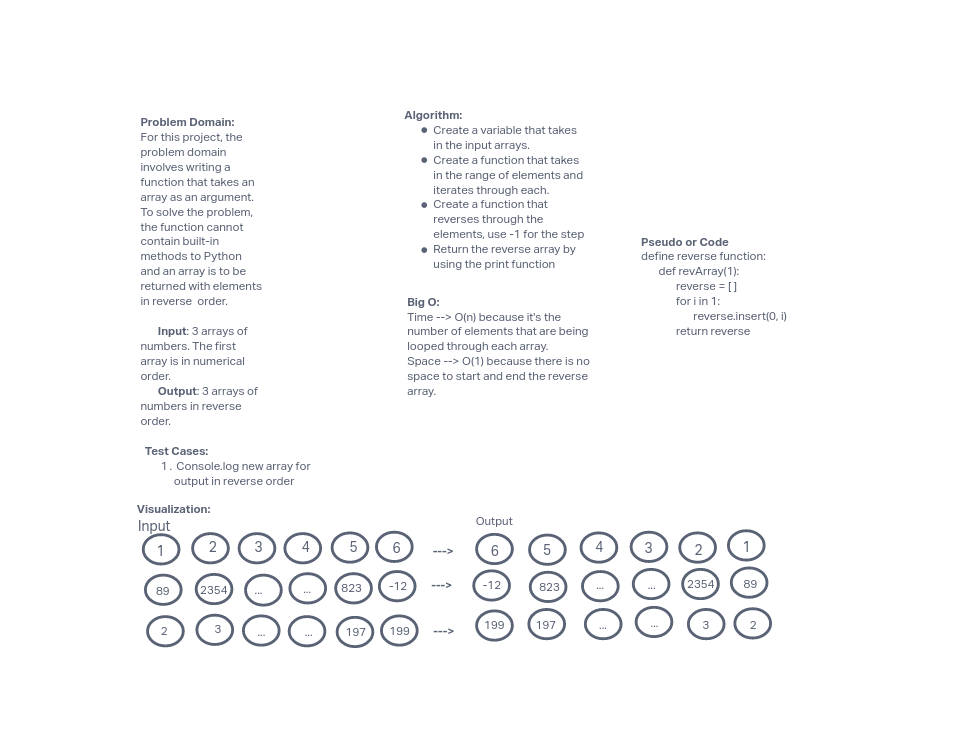

# Data Structures and Algorithms

See [setup instructions](https://codefellows.github.io/setup-guide/code-301/3-code-challenges), in the Code 301 Setup Guide.

## Repository Quick Tour and Usage

### 301 Code Challenges

Under the `javascript` folder, at the top level, is a sub-folder called `code-challenges`

Each day, you'll add one new file to this folder to do your work for the day's assigned code challenge

If you have not already done so, run `npm install` from within this folder to setup your system to be able to run tests using `Jest`

To run your tests

- Change to the `javascript` folder
- run `npm test` to run all of the tests
- run `npm test ##` to only run tests for challenge ## (i.e. 01)

### 401 Data Structures, Code Challenges

## Reverse an Array

This challenge was to write a function that took in an array as an argument and returned a new array with the elements reversed.

### Whiteboard Process

### Approach & Efficiency

My approach to this challenge was to visualize the arrays in reverse and identify a method that would appropriately reverse the array elements. The Big O space/time for this approach was to loop through the elements in the input order and figure out if there was no space to reverse the order from start to end.
