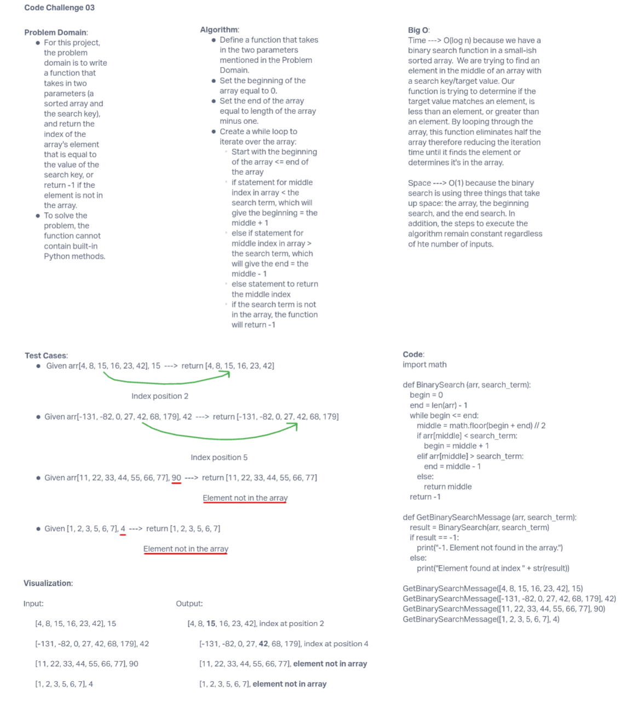

# 401 Data Structures, Code Challenges

## Binary Search of Sorted Array

This challenge was to conduct a binary search in a sorted 1D array.

### Whiteboard Process

### Approach & Efficiency

My approach to this challenge was to identify the appropriate for the function that would best return the output for each array. The _which_ statement and if, elif, and else clauses fit for the intended output. The Big O time complexity for this challenge was O(log n) because of the binary search function in a sorted array. The space complexity was O(1) because the binary search was using three things to iterate through the array even though they were not memory intensive.
