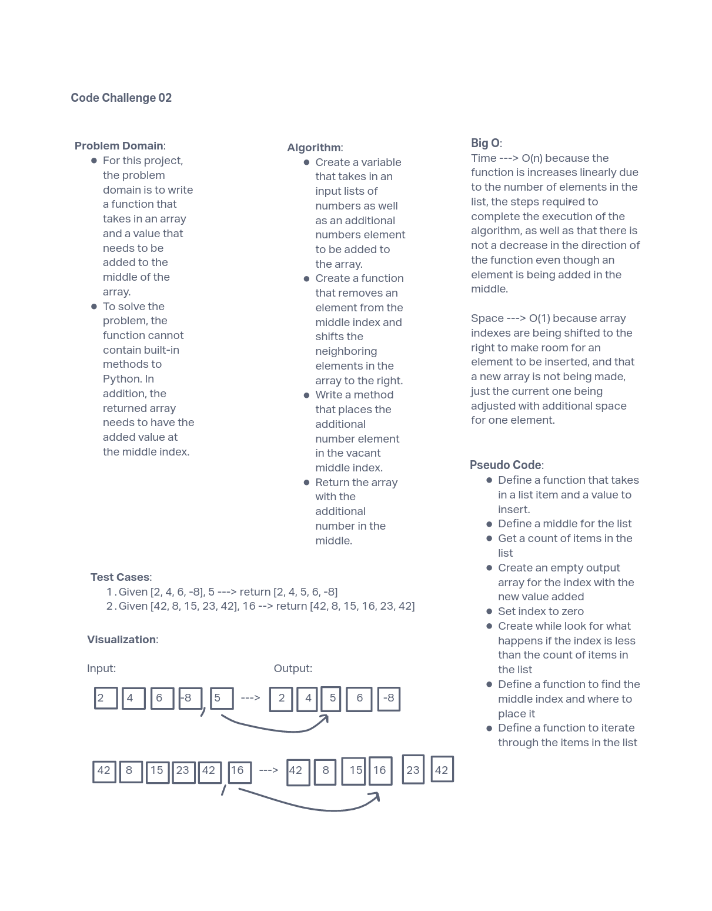

# 401 Data Structures, Code Challenges

## Insert to Middle of an Array

This challenge was to insert and shift an array in the middle at index.

### Whiteboard Process

### Approach & Efficiency

My approach for this challenge was to keep it simple and identify a non-built in method that would move the existing indexes creating a space for an element to be added to the array. The insert method seemed like the easiest method to use was the insert method. The Big O time complexity for this challenge was O(n) due to the linear progression of the function and that only one element was being added. The space complexity was O(1) because the indexes were being shifted to the right to make room to insert the one element, so there wasn't a lot of memory usage required.
