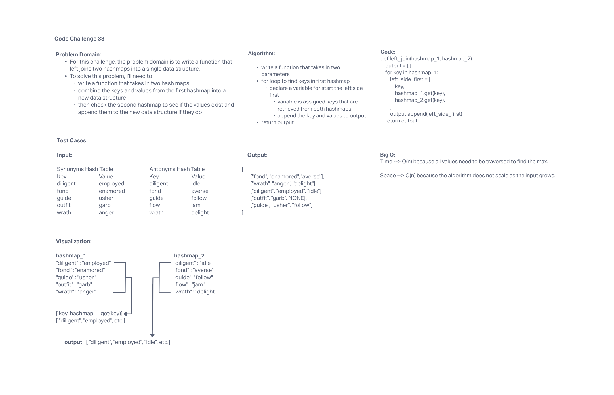

# 401 Data Structures, Code Challenges

## Hashmap LEFT JOIN

## Challenge Summary

This challenge requires a function that left joins two hashmaps into a single data structure.

## Whiteboard Process

## Approach & Efficiency

The approach for this challenge is to write a function that takes in two hash maps as arguments, then to traverse the first (left) hashmap checking the strings as keys and synonyms as the keys' values and return them in an array. Then travers the second (right) hashmap checking if the keys and values in it already exist in the first hashmap. If they do, then they are appended to the returned in the array.

## Solution

run tests using 'pytest'
