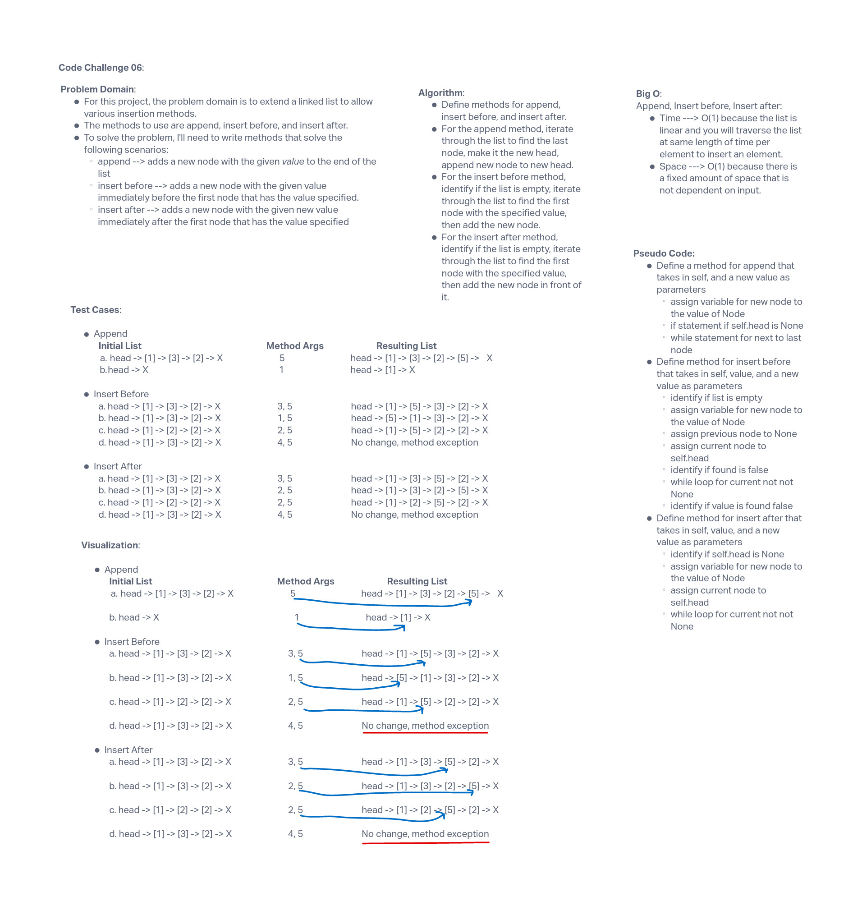

# 401 Data Structures, Code Challenges

## Data Structure: Extending an implementation

## Challenge Summary

Extend the linked list to allow various insertion methods, such as append, insert before, and insert after.

## Whiteboard Process

## Approach & Efficiency

The approach to this challenge was to start out with the Feature Tasks methods to get the intial functions created, then to move on to testing the functionality with the unit tests. This approach made the most sense as I was able to modify the functions to pass the tests. The Big O time complexity for this challenge is O(1) because the list is linear and you will traverse the list at same length of time per element to insert an element. The space complexity is O(1) because there is a fixed amount of space that is not dependent on input.

## Solution

run tests using 'pytest'
