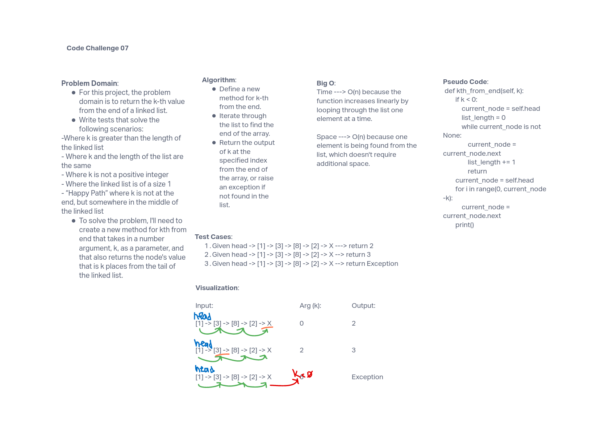

# Data Structure: Extending an implementation

## Challenge Summary

The challenge for this assignment was to write a method that returns a node's value that is _k_ places from the tail of the linked list.

## Whiteboard Process

## Approach & Efficiency

The approach to this challenge was to determine the length of the list then add the parameter for the _k-th_ place from the tail of the linked list. To do this, the list needed to be traversed through to find the tail. The Big O for this approach is O(n) for time because the function increases linearly when looping through. The Big O for space is also O(n) because one element is being found from the list, which doesn't require additional space.

## Solution

run tests using 'pytest'
