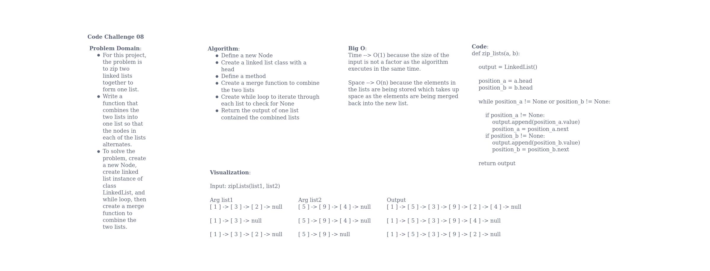

# Challenge Summary

Write a function that takes in 2 linked lists as arguments and returns one new linked list with both linked list represented in it. The new linked list needs to have the nodes of each of the 2 lists alternating between them, and returns a reference to the zipped list.

## Whiteboard Process

## Approach & Efficiency

My approach to this challenge was to start out with the while loop by identifying what the function was supposed to output. Once I identifed that, I was able to fill in the rest of the method. The Big O space/time for this approach was to iterate through the elements in each list (time = O(1)) checking for null values, then store the each element so it could be placed in the new loop in sorted order (space = O(n)

## Solution

def zip_lists(a, b):

    output = LinkedList()

    position_a = a.head
    position_b = b.head

    while position_a != None or position_b != None:

        # in while loop, alternate appending nodes to new list
        if position_a != None:
            output.append(position_a.value)
            position_a = position_a.next
        if position_b != None:
            output.append(position_b.value)
            position_b = position_b.next

    return output
