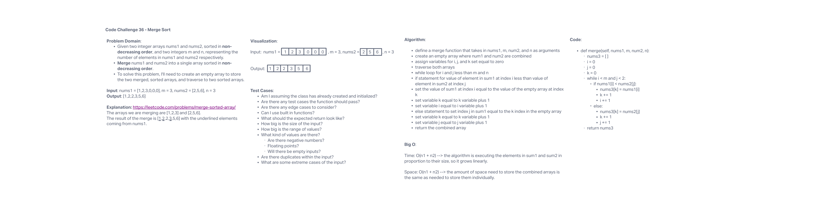

# 401 Data Structures, Code Challenges

## Merge Sort

## Challenge Summary

The challenge for this assignment was to write a function that merge two non-decreasing order arrays into one sorted array.

## Whiteboard Process

## Approach & Efficiency

The approach to this challenge was to define a function that took in the two arrays and the variables representing the integers in the two arrays, create an empty array to store the two merged array, traverse the arrays then store then in the empty array, then return the combined array. The Big O time and space complexity for this approach is O(n1 + n2).

## Solution

run tests using 'pytest'
