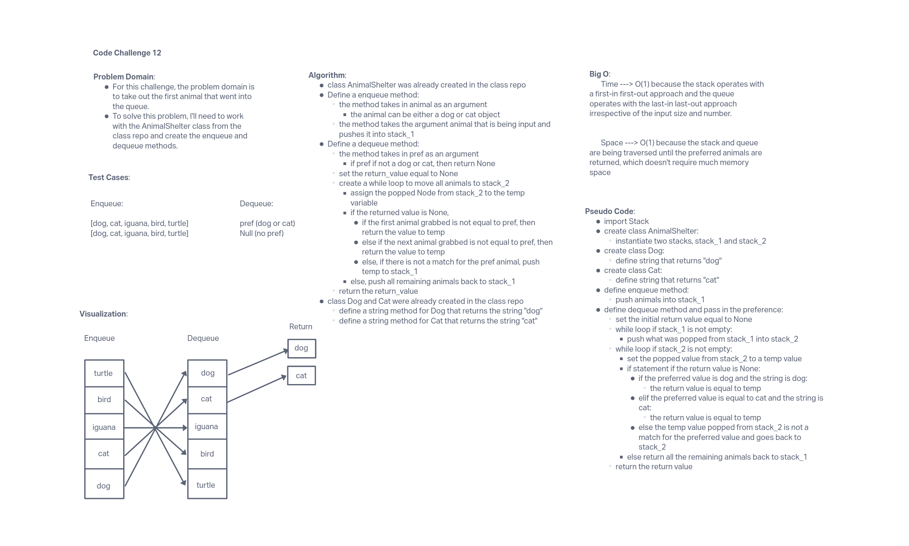

# Stack and Queue Animal Shelter

## Challenge Summary

Create enqueue and dequeue methods under a class called AnimalShelter that will take out the first animal that went into the queue (FIFO).

## Whiteboard Process

## Approach & Efficiency

The approach for this challenge is to define enqueue and dequeue methods. The enqueue method takes in animal as an argument. The animal can be either a dog or cat object. The dequeue method takes in pref as an argument. If pref if not a dog or cat, then return None. Create a while loop to iterate through the aninals in stack_2 and check if it's the preferred animal. If not, return to stack_1.

## Solution

run tests using 'pytest'
