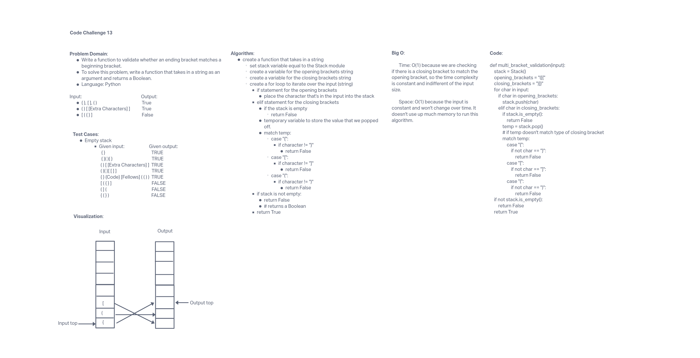

# Stack-Queue-Brackets

## Challenge Summary

Write a function that takes in a string argument and returns a Boolean that represents whether or not the brackets in the string are balanced.

## Whiteboard Process

## Approach & Efficiency

The approach for this challenge is to creater a for loop that will look for the opening and closing brackets in the input and output to see if they match (balance). In order to do that, we need to check if the stack is empty and if so, pop the top value to a temporary Node, then proceed to check the other values for the closing brackets. Then push them back to the input stack if there is a match found. Return false if the stack is not empty.

## Solution

run tests using 'pytest'
