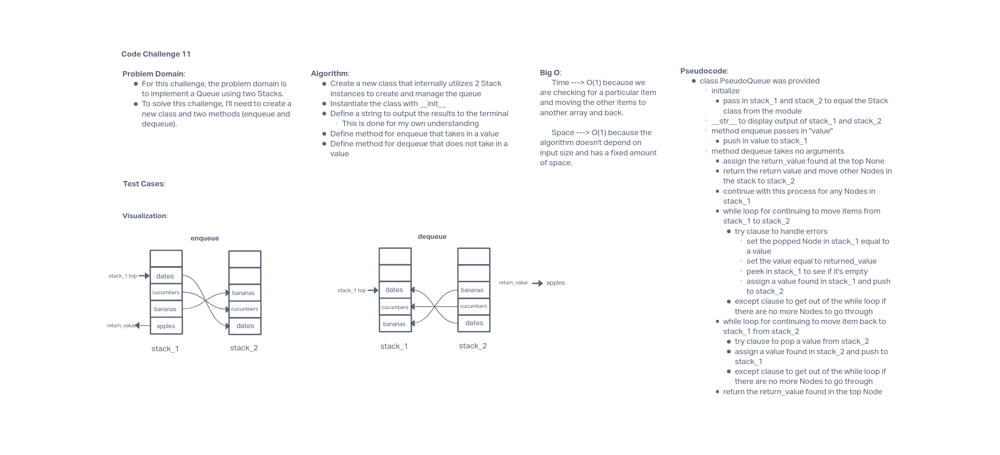

# Code Challenge / Algorithm

## Challenge Summary

This challenge is designed to implement a Queue using two Stacks, and test the methods against unit tests.

## Whiteboard Process

### Approach & Efficiency

The approach taken for this challenge was define the methods for enqueue and dequeue and pass in the arguments, if any. Next, I needed to find a way to catch any errors from peeking at the top Node while continuing to check for other nodes to pop and push from stack one to stack two. Then, return the non-dequeued items back to stack one.

The Big O for this method is O(1) for both time and space complexity. This is because we are checking for a particular item and moving the other items to another array and back, and because the algorithm doesn't depend on input size and has a fixed amount of space.

## Solution

run tests using 'pytest'
