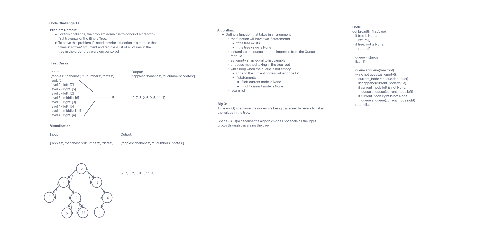

# 401 Data Structures, Code Challenges

## Breadth-first Traversal

## Challenge Summary

This challenge is to traverse a Binary Tree by breadth (each level) node-by-node and returning a list of values as they are encountered.

## Whiteboard Process

## Approach & Efficiency

The approach for this challenge is to create a function that takes in a tree argument then create a while statement for traversing the breadth and adding a value to a node. The Big O for time and space is O(n). Time is O(n) because the nodes are being traversed by levels to list all the values in the tree, and space is O(n) because the algorithm does not scale as the input grows through traversing the tree.

## Solution

run tests using 'pytest'
