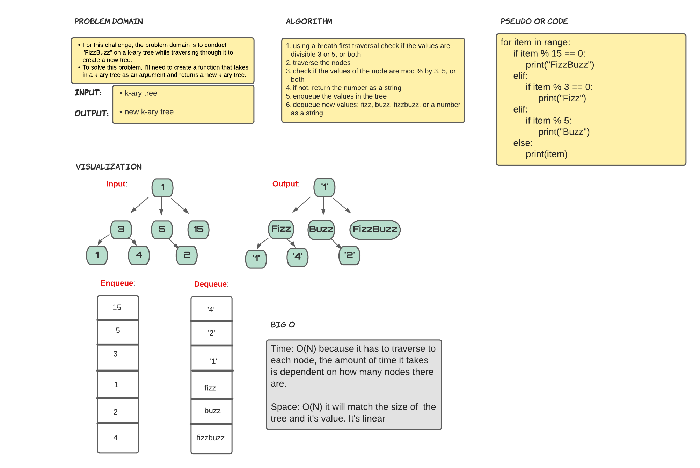

# 401 Data Structures, Code Challenges

## Tree FizzBuzz

## Challenge Summary

This challenge is to conduct "FizzBuzz" on a k-ary tree while traversing through it to create a new tree.

## Whiteboard Process

## Approach & Efficiency

The approach for this challenge is to write a function taht takes in a k-ary tree as an argument and return a new k-ary tree. To do this, create a for loop to find an item in an items array. Within the for loop iterate through the nodes to find items that are divisible by 3 and 5, by 3, or by 5. These values will be returned as FizzBuzz, Fizz, or Buzz. The items not divisible will be returned to the new k-ary tree as strings. The Big O for time and space is O(n). Time is O(n) because the tree has to be traversed by each node, so the time it takes to traverse the tree is dependent on how many nodes there are. Space is O(n) because the memory needed will match the size of the tree and it's node values.

## Solution

run tests using 'pytest'
