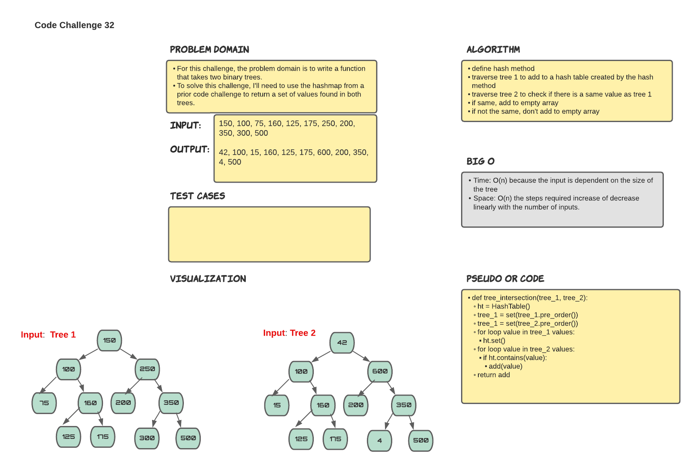

# 401 Data Structures, Code Challenges

## Tree Intersection

## Challenge Summary

This challenge is to write a function that takes two binary trees as parameters, and requires the use of the hashmap implementation from a prior code challenge as part of the algorithm, and returns a set of values found in both trees.

## Whiteboard Process

## Approach & Efficiency

The approach for this challenge was to traverse the first tree and place the values in a hash table, then to traverse the second tree comparing its values to the first tree's values in the hash table. Any values that occur in both trees are added to an empty array and returned.

## Solution

run tests using 'pytest'
