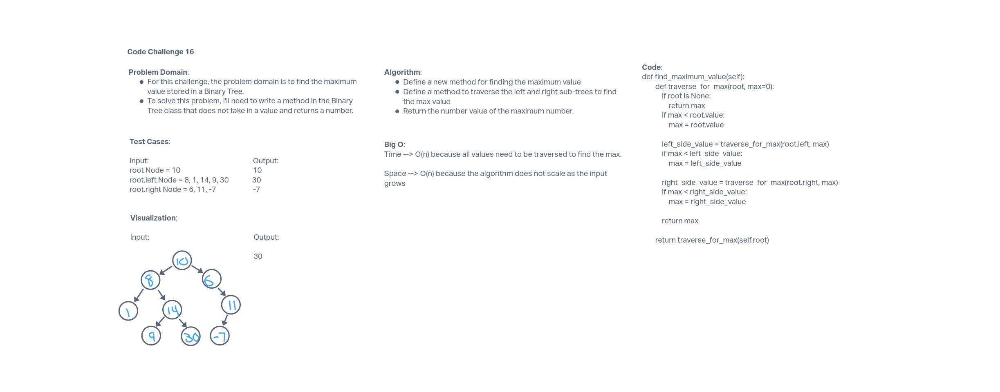

# 401 Data Structures, Code Challenges

## Tree-Max

## Challenge Summary

This challenge was to find the maximum value in the Binary Tree Class.

## Whiteboard Process

## Approach & Efficiency

The approach for this challenge was to define a method in the Binary Tree Class to find the maximum value by defining another method that took in the root and a value equal to zero and create if statements covering the values for root, left side, and right side compared to the max value found at that point.

The Big O for this approach is O(n) for both time and space. For time, all the values need to be traversed to find the max, and for space, the algorithm does not scale as the input grows.

## Solution

run tests using 'pytest'
