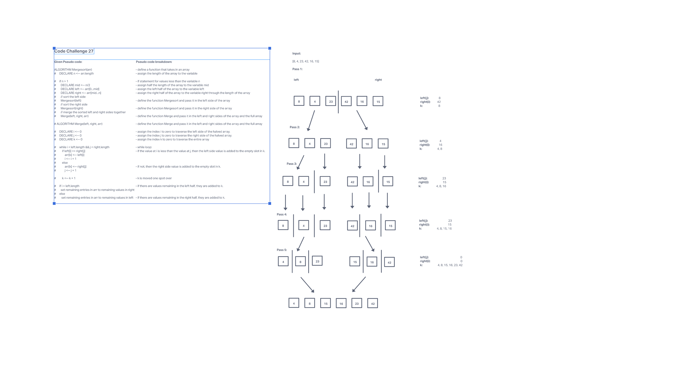
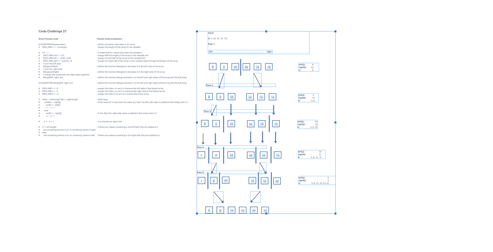

# Blog Notes: Merge Sort

## This blog will discuss how merge sorts work and provide a visual output to help you understand.

### Visual

### Trace/Step-through

### Big O Efficiency

Merge sort is a recursive algorithm, so the time complexity is O(n) and the space complexity is O(n).
